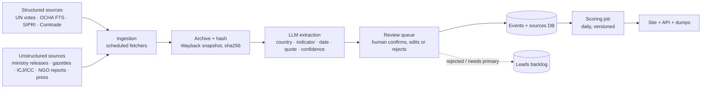

# Gaza Accountability Index — Cahier des charges

Sep 26, 2026 · @Mohamed ZOUAD

## 1. Purpose & positioning

The Gaza Accountability Index (working name) scores every country in the world, on one universal scale, by what it has actually done regarding Gaza since 7 October 2023. The number is a description of conduct, not a legal finding; every point comes from a dated action with a linked source.

**One-line thesis:** "Every government, one scale, every point sourced. What has your country done about Gaza?"

**What it is**

- A single score per country, from strongly negative (materially sustaining the war) to strongly positive (acting to stop it), with silence and inaction scored below zero.
- A time series: the score moves when conduct changes, and every movement is tied to a dated event.
- A public dataset and API, so journalists, researchers and NGOs can reuse the numbers without trusting the site.

**What it is not**

- Not a court: it never states that a country "is complicit" in a legal sense. It shows the conduct and lets the reader name it.
- Not a moral ranking of peoples: it scores government action, never populations.
- Not complete: where a country publishes nothing, the site shows a gap, not a zero.

**Who it is for, in priority order**

1. Journalists — need a novel finding, a clean footnote and a country-vs-peers comparison.
2. Parliamentary staff and NGO researchers — need the dataset, the methodology and a citable version number.
3. Activists and the public — need a shareable country card and a "what changed this month" feed.

**Standpoint.** The About page states openly that the project was started by someone who believes the response of most governments has been inadequate. The credibility claim is not neutrality; it is that the method is published, versioned and reproducible, so that belief cannot leak into the numbers.

## 2. The scale

One scale, from −100 to +100, applied identically to all 193 UN member states plus observers. Zero is not "neutral": it is the score of a country that has done nothing at all, and it sits below the pass line.

| Band | Score | Meaning | Illustrative conduct |
| --- | --- | --- | --- |
| Sustaining | −100 to −51 | Materially enabling the military campaign | Major arms supplier, active political shielding at the UN, sanctions on the ICC |
| Enabling | −50 to −21 | Contributing without leading | Components in the supply chain, trade as usual, abstains on ceasefire votes, defunded UNRWA |
| Passive | −20 to 0 | Silence or gestures only | No arms trade but no measures either; votes yes at the UN and does nothing else |
| Acting | +1 to +40 | Concrete measures with a cost | Suspended licences, restored and increased aid, formal statements naming violations, recognised Palestine |
| Confronting | +41 to +100 | Sustained action across several fronts | Full arms embargo, joined or intervened in the ICJ case, sanctions on officials, trade restrictions, led coalitions |

**Three rules that define the scale**

1. **Conduct, not promises.** Announcing a review scores nothing; a suspended licence scores. A statement scores only if it is formal (head of government, foreign minister, parliament) and names the conduct.
2. **Silence is negative.** A country with no measures, no votes recorded against, and no aid sits at roughly −15, not 0. The site says why on the methodology page: at this scale of harm, inaction is a choice.
3. **Material weight beats symbolic weight.** Selling munitions costs more points than an ambassador's tweet earns. The weights (section 4) make this explicit and are public.

**Scope.** Version 1 covers conduct related to Gaza only. Conduct related to Lebanon, the West Bank and the wider region is tracked from day one as tagged events, but only enters the score when a scope extension is voted in a published methodology release (section 8). This keeps v1 defensible while the data model stays ready.

## 3. Indicators & grading

Five categories, 30 indicators. Negative points are capped per category so one giant arms deal cannot hide everything else; positive points are capped the same way so a flood of statements cannot offset munitions. Point values below are the v0 proposal, to be stress-tested before launch (section 8).

### A. Arms & military (cap −45 / +30)

| ID | Indicator | Points | Primary source | Cadence |
| --- | --- | --- | --- | --- |
| A1 | Major conventional arms delivered to Israel, scaled by share of Israel's imports | −40 to 0 | [SIPRI Arms Transfers Database](https://www.sipri.org/databases/armstransfers) | Annual (March) |
| A2 | Ammunition, components, dual-use military goods exported (HS 93, 8710, 8802, 8526) | −25 to 0 | Israeli Tax Authority customs data, UN Comtrade, national licence registers, NGO investigations | Quarterly |
| A3 | Participation in the F-35 supply chain | −15 | UN Special Rapporteur reports, Lockheed supplier disclosures | On change |
| A4 | Arms purchased from Israel (new contracts since Oct 2023) | −15 to 0 | SIPRI, national procurement notices | Annual |
| A5 | Military cooperation: joint exercises, intelligence sharing, basing, weapons transit via ports or airspace | −5 per confirmed instance, cap −15 | Defence ministry releases, investigative journalism | On event |
| A6 | Export licences suspended (partial) | +10 | Government decision, official gazette | On event |
| A7 | Full two-way arms embargo in force | +25 | Law or decree | On event |
| A8 | Transit denied to arms shipments (ports, airspace, flagged vessels) | +5 per instance, cap +10 | Port authority, government statement | On event |

### B. Diplomacy & international law (cap −40 / +45)

| ID | Indicator | Points | Primary source | Cadence |
| --- | --- | --- | --- | --- |
| B1 | UN General Assembly votes on Gaza ceasefire, UNRWA, Palestine status | yes +3 / abstain −2 / no −5 / absent −2, per vote | [UN Digital Library](https://digitallibrary.un.org) voting records | Per vote |
| B2 | UN Security Council veto of a ceasefire resolution (members only) | −20 per veto | UNSC records | Per vote |
| B3 | ICJ genocide case: declaration of intervention filed | +15 | ICJ press releases | On event |
| B4 | Formal position rejecting or opposing ICJ provisional measures | −15 | Government statement | On event |
| B5 | ICC: public commitment to execute arrest warrants | +8 | Government statement | On event |
| B6 | ICC: stated refusal to execute warrants, or hosting a wanted official | −10 | Government statement, visit records | On event |
| B7 | Sanctions on ICC judges or prosecutors | −20 | Official sanctions list | On event |
| B8 | Recognition of the State of Palestine after Oct 2023 | +8 (pre-existing recognition +3) | Foreign ministry | On event |
| B9 | Head of government or foreign minister formally names violations, calls for ceasefire or an end to the blockade | +2 to +5 per statement, cap +10 | Official transcript | On event |
| B10 | Head of government declares unconditional support or denies documented violations | −5 per statement, cap −10 | Official transcript | On event |
| B11 | Sanctions on Israeli ministers or settler entities | ministers +10, settlers +5 | Official sanctions list | On event |
| B12 | Ambassador recalled / relations downgraded / severed | +5 / +8 / +10 | Foreign ministry | On event |

### C. Trade & economy (cap −20 / +20)

| ID | Indicator | Points | Primary source | Cadence |
| --- | --- | --- | --- | --- |
| C1 | Trade or association agreement suspended or formally reviewed | review +4, suspension +10 | Government or EU decision | On event |
| C2 | New trade, investment or cooperation agreement signed with Israel since Oct 2023 | −10 | Treaty registers, ministry releases | On event |
| C3 | Bilateral trade with Israel continued at or above pre-war level | −2 to −8 scaled by volume | UN Comtrade, IMF DOTS | Annual |
| C4 | Ban on settlement goods (labelling alone +2) | +5 | Customs regulation | On event |
| C5 | Sovereign fund or public pension divestment from named companies | +5 | Fund ethics council decisions | On event |
| C6 | Public procurement exclusion of implicated companies | +3 | Procurement rules | On event |

### D. Humanitarian (cap −15 / +25)

| ID | Indicator | Points | Primary source | Cadence |
| --- | --- | --- | --- | --- |
| D1 | Humanitarian funding to the Gaza response, scaled per capita of GNI | 0 to +12 | [OCHA Financial Tracking Service](https://fts.unocha.org) API | Monthly |
| D2 | UNRWA funding suspended | −10 | UNRWA donor tables | On event |
| D3 | UNRWA funding restored / increased above 2022 level | +5 / +8 | UNRWA donor tables | On event |
| D4 | Medical evacuations hosted, field hospitals deployed | +5 | WHO, health ministry | On event |
| D5 | Visa or refugee pathway opened for Gazans | +5 | Immigration regulations | On event |

### E. Domestic accountability (cap −10 / +10)

| ID | Indicator | Points | Primary source | Cadence |
| --- | --- | --- | --- | --- |
| E1 | Domestic investigation or prosecution of nationals or companies for conduct in Gaza | +5 | Prosecutor announcements, court filings | On event |
| E2 | Bans on Palestine solidarity protests or symbols | −5 | Interior ministry decrees, court rulings | On event |
| E3 | Universal-jurisdiction complaints accepted for investigation | +5 | Court records | On event |

**Passivity penalty.** A country with no scored event in B, C or D in the trailing 12 months receives −15. This is how "silence is negative" is implemented, and it is the single most visible rule on the site.

**Evidence rules per indicator**

- Every event needs one primary document (official record, government release, court filing, dataset row). NGO and press reports count only as *leads* until a primary document is found, or as evidence at confidence "reported" with reduced weight (section 4).
- Quantitative indicators (A1, A2, C3, D1) are computed from the dataset, never typed in by hand. The formula and the raw rows are downloadable.
- Statements (B9, B10) require the exact quote, the speaker, the date and the transcript link. Paraphrases in press are not enough.
- Category E is the most contested; it launches at low weight and is flagged as "experimental" in the methodology.

## 4. Scoring method

The score is a sum of capped category subtotals, computed daily from the event table, with a published formula and no manual overrides.

```latex
S_{c,t} = \sum_{k \in \{A,B,C,D,E\}} \mathrm{clip}\Big( \sum_{e \in E_{k,c,t}} p_e \cdot w_{\mathrm{conf}(e)} \cdot d(t - t_e),\ \mathrm{cap}^-_k,\ \mathrm{cap}^+_k \Big) - \mathrm{passivity}_{c,t}
```

Where c is the country, t the date, p the indicator points, w the confidence weight, d the time decay, and the caps are the per-category bounds from section 3.

**Event types and time handling**

| Type | Examples | How it counts |
| --- | --- | --- |
| Standing state | Embargo in force, UNRWA defunded, F-35 supplier, recognition | Full points every day while the state holds; zero the day it ends |
| Repeatable event | UN vote, statement, shipment batch, funding pledge | Full points for 12 months, then linear decay to 25% over the next 12 months, then archived (still visible, no longer scored) |
| Computed quantity | SIPRI deliveries, customs volume, FTS funding | Recomputed on each source release; trailing 12-month window |

Decay is what makes the time series meaningful: a 2023 vote should not carry the same weight as a 2026 one, but it should never disappear from the record.

**Confidence weights**

| Confidence | Evidence | Weight |
| --- | --- | --- |
| Confirmed | Primary official document | 1.0 |
| Corroborated | Two independent NGO or press investigations naming the document | 0.7 |
| Reported | Single credible report, no primary document yet | 0.4, flagged on the country page |
| Disputed | Government denial on record with counter-evidence | 0.4, both sides linked |

**Missing data.** If a country publishes no export data, A1 and A2 show "no data", not zero, and the country card carries a coverage bar (share of indicators with any data). Only the passivity penalty applies to a country with no data at all. This protects the site from its most predictable attack: punishing opacity as if it were innocence, or rewarding it as if it were absence.

**Weights are user-adjustable.** The default weights produce the published score. A "your weights" panel lets any reader re-weight the five categories and see the ranking change live. Anyone who says the weights are rigged can show their own; the underlying events do not move.

**Versioning.** Every score carries the methodology version that produced it (v1.0, v1.1…). A methodology change recomputes the whole history and publishes a diff of which countries moved and why. Old versions stay queryable.

## 5. Evidence & provenance model

The unit of the whole system is the **event**: one dated action by one country, matched to one indicator, backed by at least one **source record**. Scores are derived; events and sources are the product.

**Event record**

| Field | Example |
| --- | --- |
| id | `evt_2025_08_08_DEU_A6` |
| country | DEU |
| indicator | A6 — export licences suspended (partial) |
| date | 2025-08-08 |
| type | standing state (start) |
| points | +10 |
| confidence | confirmed |
| summary | One sentence, plain, no adjectives: what was done, by whom |
| scope tags | gaza (v1 scored), lebanon, west-bank (tracked, unscored) |
| sources | list of source ids |
| status | draft → reviewed → published → (superseded / corrected / retracted) |
| review | reviewer id, date, notes |

**Source record**

| Field | Example |
| --- | --- |
| id | `src_0421` |
| kind | official document / dataset row / court filing / NGO report / press |
| url | original link |
| archive\_url | Wayback or archive.today snapshot taken at ingestion |
| sha256 | hash of the archived file |
| quote | the exact passage that supports the event, with page or paragraph |
| language | original language, plus the translation shown |
| retrieved\_at | timestamp |

**Rules**

- Nothing is published from a live URL alone; the archived copy and its hash are what the site shows. Sources disappear; the index must not.
- A statement's source is the transcript, not the article about the transcript.
- An event can be *corrected* (points or date changed, old version kept and linked) or *retracted* (removed from the score, kept in the log with the reason). It is never silently deleted.
- Every country page and every API response exposes the full chain: score → category subtotal → events → sources → archived document. A reader can verify any number in three clicks.

**Country card summary line.** Generated, never hand-written: "Score −38 (Enabling). 14 events, 9 confirmed. Coverage 71%. Last change: 2026-09-12, UNGA vote (B1, +3)." Same template for every country, so no country gets warmer prose than another.

## 6. Website functionalities

Six pages, one API, built so a journalist gets a citable fact in under a minute and a sceptic can audit it in under five.

### Pages

| Page | What it shows | Key widgets |
| --- | --- | --- |
| Home | World choropleth coloured by band, ranking strip, "changed this week" feed | Map, top movers up/down, search box |
| Ranking | All countries sorted by score, filterable by region, band, coverage | Sortable table, category mini-bars per row, weight sliders |
| Country | Score, band, coverage bar, five category subtotals, full event timeline, sources | Score gauge, timeline with annotated events, event cards, "cite this" |
| Compare | Up to 5 countries side by side, over time | Multi-line score chart, category radar, event diff |
| Methodology | Current version, full indicator table, formula, weights, changelog, corrections log | Version selector, diff viewer |
| About & data | Standpoint statement, reviewers, API docs, dataset downloads, right-of-reply form | Download buttons (CSV, JSON), API key form |

### Widgets in detail

- **Score gauge.** Horizontal bar from −100 to +100 with the five bands shaded, the country's marker, and the passivity line at 0. Hover shows the exact number and methodology version.
- **Timeline.** X axis from Oct 2023 to today, Y the score. Every event is a dot; clicking opens its card with the quote and the archived source. Steps in the line are explained on hover ("−10: UNRWA funding suspended, 2024-01-27").
- **Event card.** Indicator badge, date, one-sentence summary, confidence chip, points, source links with archive and hash. Same layout for a positive and a negative event.
- **Coverage bar.** Share of the 30 indicators with any data; grey segments name the missing ones. Sits next to the score so no one reads a score without its coverage.
- **Weight sliders.** Five sliders, default values marked, a "reset" button, and a live re-rank. The URL encodes the weights so a custom view is shareable.
- **Cite this.** Produces a footnote with country, score, band, methodology version, date, and a permalink to that day's snapshot — APA, Chicago, and plain formats.
- **Share card.** PNG of the country card, generated server-side, with the score, band, coverage and permalink. Same template for all countries.
- **Right of reply.** A form on each country page for official responses; accepted replies appear on the page verbatim, linked from the events they contest.

### API and data

- `GET /v1/countries` — scores, bands, coverage, methodology version.
- `GET /v1/countries/{iso3}/events` — full event list with sources.
- `GET /v1/scores?date=2025-06-01` — historical snapshot for any date.
- `GET /v1/methodology/{version}` — indicator table and weights as JSON.
- Nightly CSV and JSON dumps; the whole event and source tables under an open licence (CC BY 4.0 proposed).
- Embeddable widgets (score gauge, timeline) via one `<script>` tag for newsrooms.

### Languages

English and French at launch (the author's languages and the two audiences closest to hand); Arabic as the first extension. Source quotes always stay in the original language beside the translation.

## 7. Data pipeline & architecture

The pipeline turns documents into reviewed events; the site is a thin view over the event table. Automation handles ingestion and drafting; a human publishes every event.



**Ingestion**

- Structured fetchers: UN Digital Library voting records, OCHA FTS API, SIPRI annual releases, UN Comtrade — one scheduled job each, output rows straight into computed indicators.
- Watchers on official channels: foreign-ministry RSS feeds and press pages for the 60 most relevant countries, official gazettes, ICJ and ICC press releases, UNRWA donor updates.
- Lead intake: a monitored inbox and a form where readers submit a link; NGO reports (Amnesty, HRW, Forensic Architecture, Disclose) are ingested as leads, never auto-scored.

**Extraction (agentic)**

- One extraction agent per source family, with the indicator table as its schema. Output: a draft event with country, indicator, date, points proposal, the exact supporting quote, and a confidence proposal.
- A second, independent agent re-reads the archived document and checks the quote exists verbatim and supports the indicator. Disagreement sends the draft to the queue with both readings attached.
- No agent can publish. The review queue is the only path to the event table.

**Review**

- Reviewer sees the draft, the archived document with the quote highlighted, and the agent's reasoning. One click confirms, or edits points/date/confidence with a note.
- Weekly batch: aim for under 2 hours per week of review once the backfill is done. Backfill of Oct 2023 to launch is the big one-off effort (section 9).

**Stack (proposal)**

| Layer | Choice | Why |
| --- | --- | --- |
| Ingestion & extraction | Python, scheduled jobs, Anthropic SDK with structured outputs | Fits existing skills; prompts versioned with the methodology |
| Storage | Postgres (events, sources, reviews), object store for archived documents | Relational fits the audit chain; cheap |
| Scoring | Pure function over the event table, run nightly, results materialised per date | Reproducible; any snapshot recomputable |
| Site | Static-first (Next.js or Astro) with API routes; map via MapLibre; charts via a small SVG library | Fast, cacheable, embeddable |
| Review UI | Minimal internal app or even a Notion/Airtable view over the queue at v0 | Do not over-build before reviewers exist |
| Hosting | Standard cloud, everything reproducible from the public dumps | If the site dies, the data survives |

**Repos.** Two public repositories: `methodology` (the indicator table, weights, changelog, prompts) and `data` (nightly dumps). The site code can be public too; the methodology repo is the one that must be.

## 8. Governance & credibility

Trust is earned by being auditable and by being seen to correct itself; nothing here is optional.

**Methodology as a versioned document.** Lives in the public `methodology` repo. Changes go through a pull request with a written rationale, a recomputed diff of every country that moves, and a two-week public comment window before merge. Version numbers: major for scale or category changes, minor for indicator or weight changes, patch for wording.

**Reviewers.** Two to three named external reviewers before launch: at minimum one international-law academic and one person with arms-trade data experience (SIPRI-style). They sign off on the indicator table, not on individual events. Their names and a one-line disclosure of affiliations sit on the About page.

**Right of reply.** Any government or embassy may submit a response to a specific event. It is published verbatim on the country page within 10 days, linked from the event, with the project's answer beneath it. A contested event moves to confidence "disputed" until resolved.

**Corrections log.** A public page listing every correction and retraction: what was wrong, who flagged it, what changed, when. The first entries should be the project's own, found during backfill. An empty corrections page reads as either dishonest or unused.

**Consistency checks, run before every publish**

- Same conduct, same points: a script flags two events on the same indicator with different points in the same window.
- Symmetry test: for each negative indicator, name the positive counterpart or explain why none exists (A1 ↔ A7, D2 ↔ D3).
- Tone audit: summaries are generated from a template; a monthly sample is read for adjectives and hand-fixed if any slipped in.

**Independence.** No funding from any government. Funding sources listed on the About page. If the project later joins an NGO or a university lab, the methodology repo stays independent with its own reviewers.

**Author identity.** Decide before launch whether the project is signed or run under a collective name. A signed project gets more trust from journalists; an unsigned one is safer for the author. Either is defensible; changing later is not.

## 9. Roadmap

Four phases, each with a gate that must be passed before the next. Effort assumes one person working part-time with coding agents, plus reviewer time.

| Phase | Weeks | Deliverable | Gate |
| --- | --- | --- | --- |
| 0 — Methodology | 1–3 | Indicator table finalised, points stress-tested on 10 sample countries by hand, reviewers recruited | A law academic says "defensible"; the 10 hand-scored countries feel right to three people who disagree politically |
| 1 — Scorecard | 4–9 | Pipeline for structured sources, backfill of 40 countries (top arms exporters, G20, EU, Arab League, notable actors), site with country pages, event cards, sources, coverage bars — **no composite score yet** | 500 published events; first outside person finds an error and it is corrected publicly |
| 2 — Index | 10–14 | Scoring engine, bands, timeline, ranking, compare, weight sliders, API, cite button, methodology v1.0 published | First citation by a journalist or NGO; right-of-reply form live |
| 3 — Scale | 15–26 | All 193 states, French and Arabic UI, embeddable widgets, monthly "what changed" report, scope extension debate (Lebanon, West Bank) | Under 2 h/week maintenance; one institutional partner |

**Why the scorecard ships before the score.** Facts with sources are hard to attack; a composite number invites a methodology fight on day one. Phase 1 builds the fact base and the reputation; Phase 2 adds the number once the facts have survived contact with hostile readers.

**Backfill plan.** The 40-country backfill is the largest single task: roughly 30 to 60 events per major country from Oct 2023 to launch. Structured sources cover B1, D1, A1 automatically; the rest is agent-drafted from ministry archives and reviewed. Budget 60 to 80 hours of review across the phase.

**Distribution, from Phase 1.** Post the first 10 country scorecards to Tech for Palestine for volunteers and feedback; approach Disclose and one French newsroom with a single novel finding from the data, not with the site. Journalists cite findings, not tools.

## 10. Risks & open decisions

**Risks**

| Risk | Likelihood | Mitigation |
| --- | --- | --- |
| Accused of bias and dismissed unread | Certain | Standpoint declared, method public, weights adjustable, right of reply, corrections log |
| Data asymmetry: open democracies publish export data, others don't, so the transparent get scored harder | High | Coverage bar next to every score; "no data" never becomes zero; use third-party trade data (Comtrade, ITA) to fill gaps |
| Goes stale after launch | High | Structured sources automated; under 2 h/week review target; monthly report as a forcing function |
| One error becomes the whole story | Medium | Confidence weights; nothing published without a primary or two corroborations; correct fast and publicly |
| Legal pressure (defamation, platform takedowns) | Low for states, medium if companies are named | Score states only in v1; companies appear only as they appear in cited public reports |
| Personal exposure for the author | Medium | Decide signed vs collective name before launch; T4P supports anonymous contributors |
| Points feel arbitrary | Medium | Stress-test on 10 countries with politically diverse readers; publish the sensitivity of the ranking to each weight |

**Open decisions (need an answer before Phase 0 ends)**

- [ ] Name: *Gaza Accountability Index* vs a name without "Gaza" that survives a scope extension.
- [ ] Passivity penalty size: −15 proposed. Too small and silence looks fine; too large and small states with no ties to the conflict look like enablers.
- [ ] Category E (domestic accountability): include at low weight, or track unscored until v2.
- [ ] Lebanon and West Bank: scope extension trigger — a date, a methodology vote, or never.
- [ ] Statements (B9/B10): score them at all, or track them unscored and let the material indicators speak. Scoring words is the softest part of the method.
- [ ] Signed or collective authorship.
- [ ] Licence for the dataset (CC BY 4.0 proposed) and for the code.
- [ ] Which 40 countries in the Phase 1 backfill.
